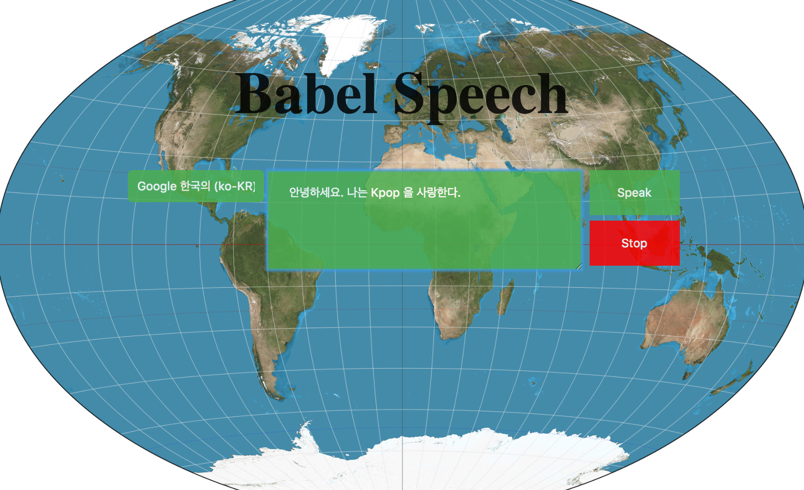
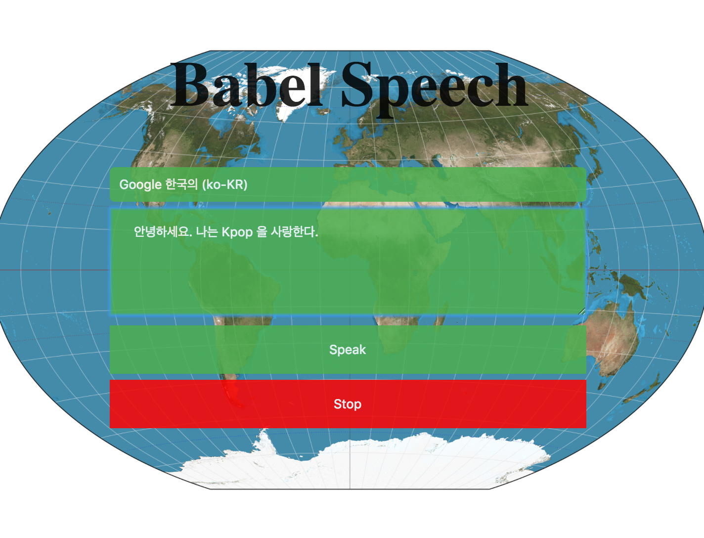

## Babel Speech

Babel Speech is a page that uses the Web Speech API to read messages to the user in different languages. Choose from a wide range of language options to read text.

The page also applies responsive web design that changes the layout depending on the size of the screen. This maximizes user experience for both desktop and mobile users.

Desktop page

Small screen page

